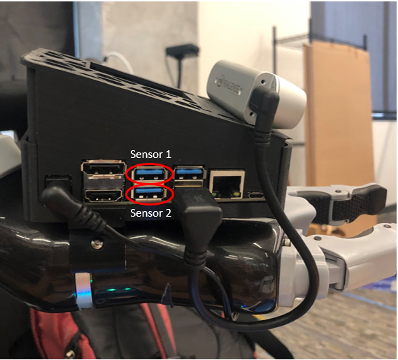

The Gelslight is the PRL's vision-based tactile sensor designed to replace the ATI Nano-25 F/T sensor used for sensorized feeding on ADA. Inspired by MIT's GelSight sensor, the Gelslight achieves the smallest form factor of its class of sensors by using a miniature wide-angle camera, clever design, and precision manufacturing equipment. 

# Marker Tracking Algorithm

## Dependencies

* opencv (v 4.2.0)
* pybind11
* numpy
* rospy

## Installation
Clone into the src folder of your catkin workspace. 
```
$ git clone https://github.com/personalrobotics/gelslight_tracking.git
cd gelslight_tracking
```

Ensure that the python version referenced in the makefile `gelslight_tracking/makefile` matches your version of Python. Then remove `find_marker.so` and make. 
```
rm -rf src/find_marker.so
make
```

## Configuration

In the first iteration of the marker tracking algorithm, the initial positions of the markers are estimated and matched to corresponding detected markers. This means there are two potential modes of error: not detecting all of the markers, and the initial positions of the markers. The success of the marker tracking algorithm is largely dependent on proper tuning of these settings. 

* If running on Ada, use `python2` rather than `python3`
* A good starting point for tuning is the last used settings

### Step 1: Marker detection

The marker detection is implemented in `src/marker_detection.py` which uses Gaussian filtering and a min-max threshold in the HSV-space to detect the yellow markers. 

Modify the parameters using the `test_find_marker.py` script which takes the image rescale value as an argument. Two images will appear: one is the raw image from the sensor, and the other is the filtered image. Slide the adjuster bars until white dots corresponding to the markers appear on a black background. 

```
python3 src/test_find_marker.py 3
```

* Press *q* to terminate the program.

**Parameters**:

* `src/marker_detection/find_marker`: The scale of the GaussianBlur on line 22. This value depends on the size of the marker on the screen.
* `src/marker_detection/find_marker`: change `yellowMin, yellowMax` on lines 35 and 36 based on markers' color in HSV space.
* `src/marker_detection/marker_center`: change the `areaThresh1, areaThresh2` on lines 50 and 51 for the minimum and maximum size of markers

### Step 2: Initial Marker Positions

The initial marker positions are implemented as an N x M array of points with constant spacing in the x and y direction, `dx`, `dy`. The position of the points is defined by the top-left dot of the array, `x0`, `y0`. These values are located in 

```
src/setting.py
```

There is not proper strain relief on the cable of the camera in the sensor, which causes the camera to shift whenever they are removed from Ada. This affects the initial marker positions and will require tuning. Expect to spend time with this tuning. 

Modify the values using the `test_settings.py` script which takes the rescale value as an argument. Initially, with non-zero `dx` and `dy` values, there will be a matrix of green arrows pointing from the red detected markers to the initial marker positions. Adjust the sliders until the arrows turn into small green spots inside the red markers. Modifying the slider values once the arrows have "snapped" into the dots will not make any considerable difference. Further adjustment should be done by re-running the script.

```
python3 src/test_settings.py 3
```

* Press *q* to terminate the program.

**Parameters**:
* RESCALE: scale down
* N, M: the row and column of the marker array
* x0, y0: the coordinate of upper-left marker (in original size)
* dx, dy: the horizontal and vertical interval between adjacent markers (in original size)
* fps_: the desired frame per second, the algorithm will find the optimal solution in 1/fps seconds

## Running Dot Tracking

**Base version**

The dot tracking script `tracking.py` takes two argument: sensor id and rescale value. These inputs are used to select the dot tracking configuration in the `setting.py` file.

Launch roscore.
```
roscore
```

In another terminal, run the script
```
cd ~/<path_to_ws>/src/gelslight_tracking
python3 src/tracking.py 1 3
```
which takes the sensor identifier flag and the image rescale value as arguments, respectively. 

* A higher rescale value decreases the resolution of the image which increases the frequency of the dot tracking algorithm. Changing this value will require modifying the settings.
* Press *q* to terminate the program.


**Running on ADA**

Turn on ADA. SSH into the Nano with x forwarding and set weebo as the Ros Master
```
ssh -X nano
useweebo
```
Either run the base tracking script or the tracking with taring action script (if running the feeding demo without the ATI F/T sensor). Note that Nano uses python2 rather than python3. 
```
cd ~/catkin_ws/src/gelslight_tracking
python2 src/tracking_w_taring_action.py 1 3
```

**Note**: The USB ports on the Nano which the sensors are plugged into affect the ordering of the camera ports when powering on ADA. 



## Output

**Tracking**

The tracking algorithms will display the camera feed and print the force and torque in the Z-direction. The gelsight node initialized by these scripts publishes the camera feed and a 6-DOF Wrench (2 implemented).

## Common Issues
* ZeroDivisionError likely means you are using the Intel RealSense camera rather than the Gelslight camera. Ensure the sensors are plugged into the correct ports and reboot ADA. Or change the cv2.VideoCapture camera index  in the code. 

* If the Gelslight sensor feed has large green and/or red arrows, refer to the marker matching section. The ideal initial image should consist of green arrows with 0 length which will appear as dots. If you are having trouble closing video windows, refer to [this](https://unix.stackexchange.com/questions/113893/how-do-i-find-out-which-process-is-using-my-v4l2-webcam).
* `Import Error: /<path_to_ws>/gelslight_tracking/src/find_marker.so` is an issue with the defined python version in the makefile. Update the python calls in `/<path_to_ws>/gelslight_tracking/makefile`. Note that python3 is used when running on Weebo and python2 is used when running on Nano. 

## To Do
* The calibration process in its current state is tedious and painful. Something that may help is to design a better strain relief for the camera cable. Larger and fewer markers may also be helpful as it will improve the marker detection and decrease overall latency. 
* False positives may occur for marker detection due to debris getting trapped between the gray ink and the sensor pad, or the clear silicone securing the pad to the core which allows external lights to be seen by the camera. Again, larger and fewer markers may help false positives as well as false negatives. Different colored ink like red or blue may decrease false positives as well. 
* A common issue with the marker tracking that occurs when pushing on the fork is the displacement vectors freezing when the force is released. This occurs because the force is released too rapidly. This creates a large displacement which may not register with the tracking algorithm. Potential solutions may be to speed up the algorithm and ensure that force changes are not too rapid. 
* New calibration are required for average linear displacement and force. 
* Slipping between the sensor pad and the fork handle causes issues as the dots may permanently deform, causes discrepancies in the force reading. 
* An unexplored property is degradation over time of the sensor pad. The silicone ink may rub off and the silicone properties may not be constant with respect to time.
